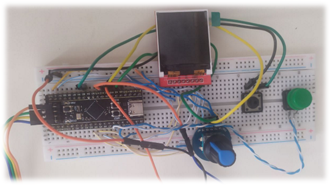
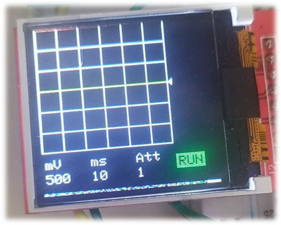
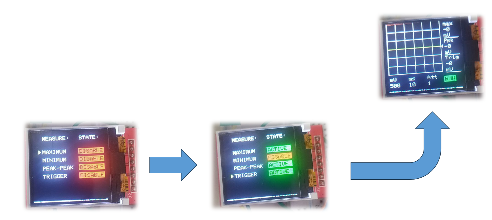
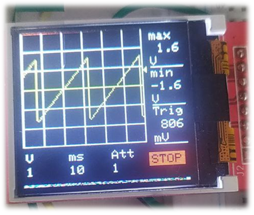
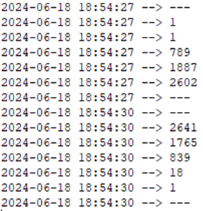

# Осциллограф на STM32

Данный проект представляет собой базу для самодельного осциллографа, где реализован интерфейс и отображение графиков напряжения на входе встроенного АЦП. Проект находится на стадии доработки.

Проект написан при помощи следующего ПО:
* IDE Keil (версия 5.26.2.0)
* STM32 Cube MX (версия 6.8.0)

Демонстрация работы макета представлена в [видео](https://drive.google.com/file/d/1elQttJZGAs2gEO0Mv5Yj4w3iH7lKBW2F/view?usp=sharing).

## Техническое задание

Создание макета осциллографа, обладающего следующими функциями:
* Отображение графика напряжения в реальном времени
* Возможность изменения развёрток по напряжению и по времени
* Наличие меню выбора дополнительных отслеживаемых параметров
* Перестройка триггера

## Этапы реализации проекта

### 1 - Подсоединение периферии

На данном этапе производилась сборка всей периферии проекта и конфигурация аппаратных блоков МК, ответственных за внешние устройства.

Были соединены:
1.  МК STM32F401CCU6 («Black Pill»)
2.  энкодер (+ таймер)
3.  две кнопки (+ внешние прерывания)
4.  дисплей ST7735 (+ аппаратный SPI)
5.  мост USB-UART (+ аппаратный UART)

### 2 - Вывод на экран сетки и развертки

В данном разделе были сформированы функции для отрисовки стеки для графика, а также вывода на экран начальных изображений параметров сетки и осциллографа. К таким параметрам относятся:
* Цена деления одной клетки по вертикали в вольтах / милливольтах
* Цена деления клетки по горизонтали в (милли- / микро- ) секундах
* Значение предделителя входного сигнала(“Att”)
* Окна “RUN / STOP”

### 3 - Вывод меню дополнительных параметров

В данной части было разработано меню, где можно выбрать дополнительные параметры о сигнале, которые будут рассчитываться и отображаться на экране. Для возможности перехода на данное меню был написан обработчик прерывания для ещё одной кнопки.

### 4 - Разработка блока отображения графиков

Для разработки функций отображения графиков нужно выделить отдельный таймер, который будет работать в режиме прямого счёта, и по переполнению которого будут вызываться функции, нужные для обновления графиков. Путём задания периода обновления можно задать частоту обновления кадров во всём осциллографе. При выбранных настройках обеспечивается обновления кадров с частотой 10 Гц.

### 5 - Конфигурация периферии для работы с АЦП

Для работы с АЦП необходимо сконфигурировать не только сам АЦП, но и таймер, отвечающий за период, с которым АЦП будет снимать значения. Он также будет работать в режиме прямого счёта и с прерыванием по переполнению будет заносится значения сигнала с АЦП в массив. Важно, что АЦП будет запущен в режиме непрерывного преобразования, что сделает возможным взятие значения из регистра АЦП в любой момент времени.

В данном проекте код конфигурации АЦП не представлен, так как интерфейс для подключения функций АЦП ещё не написан. Представлен только вывод измерений АЦП, проведенных черех равные промежутки времени в последовательный порт:

